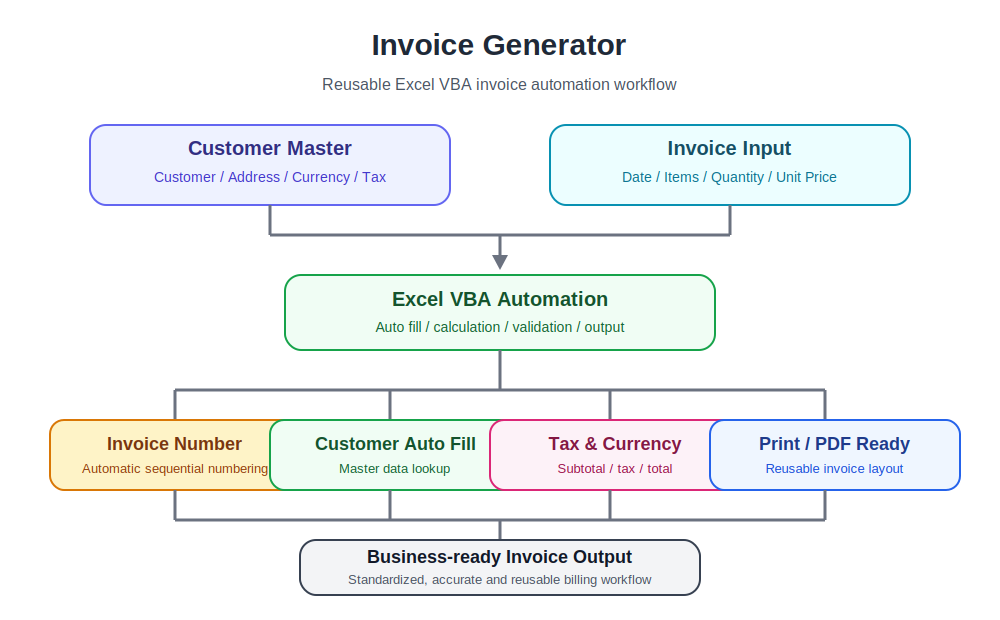

# Invoice Generator

Reusable Excel VBA toolkit for invoice generation and business workflow automation.

Built for small businesses, freelancers, and operations teams that need a simple, maintainable invoice automation solution using Microsoft Excel.

---

# Architecture

<p align="center">
  
</p>

---

# Features

✓ Excel Table-based Data Model

✓ Customer Master Management

✓ Customer ID Dropdown

✓ Automatic Customer Lookup (XLOOKUP)

✓ Customer Information Auto Fill

✓ Invoice Number Generation

✓ Payment Terms Support

✓ Automatic Due Date Calculation

✓ Currency Lookup

✓ Tax Rate Lookup

✓ Invoice Item Table

✓ Input Validation (Excel VBA)

✓ Print-ready Invoice Layout

✓ Cross-platform PDF Workflow

✓ Native Windows User Experience

✓ Native macOS User Experience

✓ Reusable VBA Modules

✓ Business Workflow Automation

---

# Cross-platform PDF Workflow

The workbook automatically detects the operating system.

Users never need to choose between Windows and macOS.

## Windows

```text
Generate
    │
    ▼
Save As Dialog
    │
    ▼
PDF Export
```

## macOS

```text
Generate
    │
    ▼
Native Print Dialog
    │
    ▼
PDF
    │
    ▼
Save as PDF
```

Each platform uses its native user experience instead of forcing identical behavior.

---

# Example Workflow

```text
tblCustomers
        │
        ▼
Invoice Input
        │
        ▼
Customer Lookup
(Customer / Currency / Tax / Payment Terms)
        │
        ▼
tblInvoiceItems
        │
        ▼
Subtotal
        │
        ▼
Tax
        │
        ▼
Total
        │
        ▼
Invoice Output
        │
        ▼
Generate
        │
        ▼
Windows
 Save As
        │
        ▼
 PDF Export

macOS
 Native Print Dialog
        │
        ▼
 PDF → Save as PDF
```

---

# Project Structure

```text
Invoice-Generator
│
├── README.md
├── LICENSE
├── images/
├── sample/
└── src/
```

---

# Worksheets

```text
Customer Master
Invoice Input
Invoice Output
Settings
```

---

# Technologies

- Microsoft Excel
- Excel Tables
- Structured References
- XLOOKUP
- Excel VBA
- Data Validation
- Cross-platform Design
- Business Automation

---

# Current Functions

- Customer Master management
- Customer ID dropdown list
- Automatic customer lookup
- Automatic customer information fill
- Automatic currency lookup
- Automatic tax rate lookup
- Payment terms lookup
- Automatic due date calculation
- Invoice number generation
- Invoice item table
- Automatic subtotal calculation
- Automatic tax calculation
- Automatic total calculation
- VBA input validation
- Print-ready invoice layout
- Cross-platform PDF workflow
- Automatic operating system detection
- Windows native PDF export
- macOS native Print → PDF workflow

---

# Future Roadmap

- Automatic PDF File Naming
- Email Sending
- Multi-Currency Support
- Invoice History
- Automatic Invoice Number Sequence
- Dashboard
- API Integration
- Cloud Integration

---

# Example Use Cases

- Small Business Invoicing
- Freelancer Invoice Generation
- Internal Billing
- Client Billing
- Service Invoice Templates
- Sales Operations
- Business Workflow Automation

---

# Why This Project?

Many businesses still create invoices manually in Excel.

This project demonstrates how repetitive billing tasks can be standardized and automated using Excel Tables, XLOOKUP, Structured References, and reusable VBA modules.

Rather than forcing identical behavior across different operating systems, the workbook automatically detects Windows and macOS and provides the most natural workflow for each platform.

The goal is not identical code.

The goal is a consistent user experience.

Windows users export PDFs directly through Excel.

macOS users use the native **Print → PDF** workflow provided by the operating system.

This approach keeps the workbook maintainable while respecting the strengths of each platform.

---

# Design Principles

- Table First Design
- Reusable VBA Modules
- Cross-platform Architecture
- Native User Experience
- Structured References
- Maintainable Workbook Architecture
- Business-oriented Automation
- Scalable Excel Solutions

---

# License

MIT License
