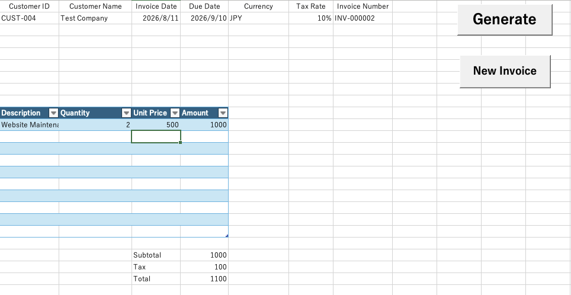
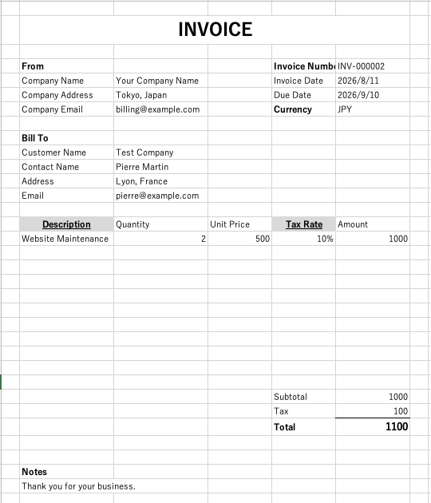
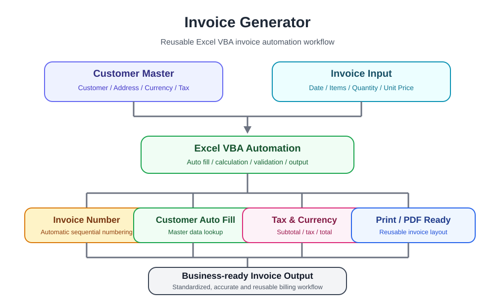

# Invoice Generator

A cross-platform Excel VBA invoice generator designed for practical business workflow automation.

Built for small businesses, freelancers, and operations teams that need a simple, maintainable way to create invoices using Microsoft Excel.

The workbook combines Excel Tables, structured formulas, reusable VBA modules, input validation, automatic invoice numbering, and platform-aware PDF workflows.

---

## Screenshots

### Invoice Input

<p align="center">
  
</p>

### Invoice Output

<p align="center">
  
</p>

---

## Architecture

<p align="center">
  
</p>

---

## Features

- Excel Table-based data model
- Customer master management
- Customer ID dropdown
- Automatic customer lookup
- Automatic customer information fill
- Automatic due date calculation
- Currency lookup
- Tax rate lookup
- Invoice item table
- Automatic subtotal calculation
- Automatic tax calculation
- Automatic total calculation
- Sequential invoice number generation
- Configurable invoice numbering
- New Invoice workflow
- Required-field validation
- Combined validation messages
- Print-ready invoice layout
- Cross-platform PDF workflow
- Automatic Windows/macOS detection
- Reusable VBA modules
- Business-oriented workflow automation

---

## Workflow

```text
Customer Master
      │
      ▼
Invoice Input
      │
      ├── Customer Lookup
      ├── Currency Lookup
      ├── Tax Rate Lookup
      ├── Payment Terms
      └── Due Date Calculation
      │
      ▼
Input Validation
      │
      ├── Customer
      ├── Invoice Date
      └── Invoice Item
      │
      ▼
Invoice Number Generation
      │
      ▼
Invoice Output
      │
      ▼
Platform Detection
      │
      ├── Windows ──► Direct PDF Export
      │
      └── macOS ────► Native Print Dialog
                         │
                         ▼
                    Save as PDF
```

---

## Cross-Platform Design

Invoice Generator is designed to provide the most natural workflow available on each operating system rather than forcing identical technical behavior across platforms.

The user does not need to select an operating system.

Excel detects the current platform automatically and chooses the appropriate workflow.

### Windows

On Windows:

1. Click `Generate`.
2. The invoice is validated.
3. An invoice number is generated when required.
4. A Save As dialog is displayed.
5. Select the PDF file name and location.
6. Excel exports the invoice directly as a PDF.

### macOS

On macOS:

1. Click `Generate`.
2. The invoice is validated.
3. An invoice number is generated when required.
4. The native macOS print dialog opens.
5. Select `PDF`.
6. Choose `Save as PDF`.

Cancelling the macOS print dialog is treated as a normal user action and does not produce an application error.

---

## New Invoice Workflow

The `New Invoice` button prepares the workbook for the next invoice without removing formulas or workbook logic.

It clears only user-entered invoice data.

### Cleared

```text
Customer ID
Invoice Date
Invoice Number
Description
Quantity
Unit Price
```

### Preserved

```text
Customer lookup formulas
Due date formula
Currency lookup formula
Tax rate lookup formula
Amount formulas
Subtotal formula
Tax formula
Total formula
Table structure
Workbook configuration
```

This allows repeated invoice creation without rebuilding formulas or resetting the workbook manually.

---

## Input Validation

Before an invoice number is generated or the PDF workflow begins, the workbook validates the required invoice information.

Current validation checks:

```text
Customer
Invoice Date
At least one invoice item
```

When multiple fields are missing, all validation issues are displayed in a single message.

Example:

```text
Please complete the following fields:

- Customer
- Invoice Date
- At least one invoice item
```

Validation occurs before invoice numbering so invalid invoices do not unnecessarily consume invoice numbers.

---

## Automatic Invoice Numbering

Invoice numbers are generated sequentially using workbook settings.

Example:

```text
Invoice Prefix       INV
Next Invoice Number  2
Invoice Number Digits 6
```

Generated invoice:

```text
INV-000002
```

Numbering rules are maintained through worksheet settings rather than being hard-coded into the invoice generation workflow.

An existing invoice number is preserved when appropriate.

---

## Data Flow

```text
tblCustomers
      │
      ├── Customer Name
      ├── Contact Name
      ├── Address
      ├── Email
      ├── Currency
      ├── Tax Rate
      └── Payment Terms
      │
      ▼
Invoice Input
      │
      ├── Invoice Date
      ├── Due Date
      ├── Invoice Number
      └── tblInvoiceItems
      │
      ▼
Invoice Output
      ▲
      │
tblSettings
      │
      ├── Company Name
      ├── Company Address
      ├── Company Email
      └── Invoice Configuration
```

---

## Worksheets

### Customer Master

Stores reusable customer information such as:

- Customer ID
- Customer Name
- Contact Name
- Address
- Email
- Currency
- Tax Rate
- Payment Terms

### Invoice Input

Primary invoice-entry screen.

The user selects a customer, enters the invoice date and invoice items, and starts invoice generation from this worksheet.

### Invoice Output

Print-ready invoice generated from Customer Master, Invoice Input, and Settings data.

### Settings

Stores reusable company and invoice configuration values.

Examples include:

- Company Name
- Company Address
- Company Email
- Invoice Prefix
- Default Currency
- Default Tax Rate
- Payment Terms
- Invoice numbering configuration

---

## VBA Architecture

VBA responsibilities are separated into focused modules.

```text
Platform
│
├── Operating system detection
├── Cross-platform helpers
└── Save-path helpers

InvoiceGenerator
│
├── Invoice generation workflow
├── Windows PDF workflow
└── macOS print workflow

InvoiceNumberGenerator
│
├── Sequential numbering
├── Prefix handling
└── Number formatting

NewInvoice
│
├── Input reset
└── Formula preservation

InvoiceValidator
│
├── Required-field validation
└── Combined validation messages
```

This separation keeps platform logic, invoice generation, numbering, validation, and reset behavior independent and easier to maintain.

---

## Project Structure

```text
Invoice-Generator/
│
├── images/
│   ├── architecture.svg
│   ├── invoice-input.png
│   └── invoice-output.png
│
├── sample/
│   └── Invoice-Generator.xlsm
│
├── src/
│
├── Invoice-Generator.xlsm
├── LICENSE
└── README.md
```

---

## Technologies

- Microsoft Excel
- Excel VBA
- Excel Tables
- Structured References
- XLOOKUP
- Data Validation
- Print Layout
- PDF Workflows
- Windows/macOS Platform Detection
- Business Process Automation

---

## Design Principles

### Table First

Business data is structured around Excel Tables rather than fragile fixed ranges wherever practical.

### Formula Preservation

Reset operations clear user input without destroying lookup or calculation formulas.

### Separation of Responsibilities

Platform detection, validation, numbering, invoice generation, and reset behavior are kept in separate VBA modules.

### Configuration over Hard-Coding

Business values and invoice-numbering rules are stored in workbook settings where possible.

### Platform-Native UX

Windows and macOS are not forced through an identical technical implementation.

Instead, the workbook automatically provides the workflow that fits each platform naturally.

### User-Oriented Automation

The workbook handles technical decisions internally so users can focus on creating invoices.

---

## Example Use Cases

- Freelancer invoicing
- Small business billing
- Client billing
- Service invoices
- Internal billing workflows
- Operations automation
- Excel workflow modernization
- Cross-platform Excel VBA demonstrations

---

## Why This Project?

Many small businesses and independent professionals still rely on manually maintained Excel invoices.

Manual invoice workflows can lead to repetitive data entry, inconsistent numbering, missing information, calculation mistakes, and duplicated work.

Invoice Generator demonstrates how a familiar Excel workflow can be transformed into a structured business tool through:

- reusable customer data
- automatic lookups
- calculated payment dates
- automatic tax calculations
- sequential invoice numbering
- input validation
- reusable invoice templates
- platform-aware PDF generation

The goal is not to replace a full accounting system.

Instead, the project demonstrates practical business-process automation using Excel and VBA while keeping the workbook understandable and maintainable.

---

## Current Status

**v0.5 — Portfolio Ready**

Core invoice-generation workflow is complete.

Verified workflow:

```text
New Invoice
    ↓
Customer Selection
    ↓
Invoice Date
    ↓
Invoice Items
    ↓
Validation
    ↓
Automatic Invoice Number
    ↓
Invoice Output
    ↓
Windows / macOS PDF Workflow
```

macOS print workflow has been tested using the native Excel print dialog.

Windows direct PDF export is implemented and should be verified on a Windows Excel environment before production use.

---

## Future Roadmap

Potential future enhancements:

- Invoice history
- Email sending
- Extended multi-currency support
- Dashboard
- Invoice status tracking
- Customer-specific invoice templates
- API integration
- Cloud integration

These features are outside the current portfolio-ready scope.

---

## License

MIT License